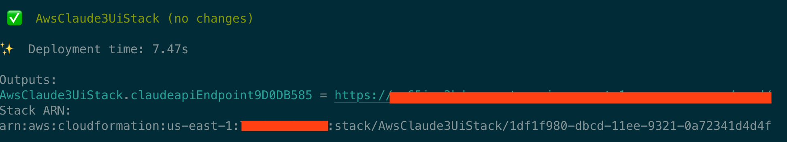

# AWS Bedrock Chat UI using Claude 3 model

What does it do?

- Creates an AWS Lambda function that interacts with AWS Bedrock

- Uses Anthropic's Claude 3 Sonnet model for chat

- Creates an AWS API Gateway endpoint to expose the API

- Deploy a chat ui on AWS

Install Guide

1.Automatically deploy api gateway and lambda and call bedrock through lambda.

- `npm i` install required libray

- `cdk deploy` deploy this stack to your default AWS account/region，get output api gateway url:

  

#### API Guide:

##### Create a Message:

Send a structured list of input messages with text and/or image content, and the model will generate the next message in the conversation.

The Messages API can be used for for either single queries or stateless multi-turn conversations.

Example with a single user message:

```json
{
  "model": "anthropic.claude-3-sonnet-20240229-v1:0",
  "max_tokens": 1024,
  "top_k": 1,
  "temperature": 0.5,
  "system": "Today is January 1, 2024.",
  "messages": [{ "role": "user", "content": "Hello, Claude" }]
}
```

Example with multiple conversational turns:

```json
{
  "model": "anthropic.claude-3-sonnet-20240229-v1:0",
  "max_tokens": 1024,
  "messages": [
    {
      "role": "user",
      "content": "Hello there."
    },
    {
      "role": "assistant",
      "content": "Hi, I'm Claude. How can I help you?"
    },
    {
      "role": "user",
      "content": "Can you explain LLMs in plain English?"
    }
  ]
}
```

with Claude 3 models, you can also send image content blocks:

```json
{
  "model": "anthropic.claude-3-sonnet-20240229-v1:0",
  "max_tokens": 1024,
  "messages": [
    {
      "role": "user",
      "content": [
        {
          "type": "image",
          "source": {
            "type": "base64",
            "media_type": "image/jpeg",
            "data": "image base64 data"
          }
        },
        {
          "type": "text",
          "text": "What is in this image?"
        }
      ]
    }
  ]
}
```

##### call API by curl:

```bash
curl -X POST -k -H 'Content-Type: application/json' -i 'https://api_gateway_url/v1/messages' --data '{
    "model": "anthropic.claude-3-sonnet-20240229-v1:0",
    "max_tokens": 1024,
    "top_k":1,
    "temperature":0.5,
    "messages": [
        {"role": "user", "content": "Hello, Claude"}
    ]
}'
```

Response message:

```json
{
  "id": "msg_01XyWaKwckzDSNhjSrpEA73p",
  "type": "message",
  "role": "assistant",
  "content": [
    {
      "type": "text",
      "text": "Hello! It's nice to meet you. How can I assist you today?"
    }
  ],
  "model": "claude-3-sonnet-28k-20240229",
  "stop_reason": "end_turn",
  "stop_sequence": null,
  "usage": {
    "input_tokens": 20,
    "output_tokens": 19
  }
}
```

### 2.deploy ui
